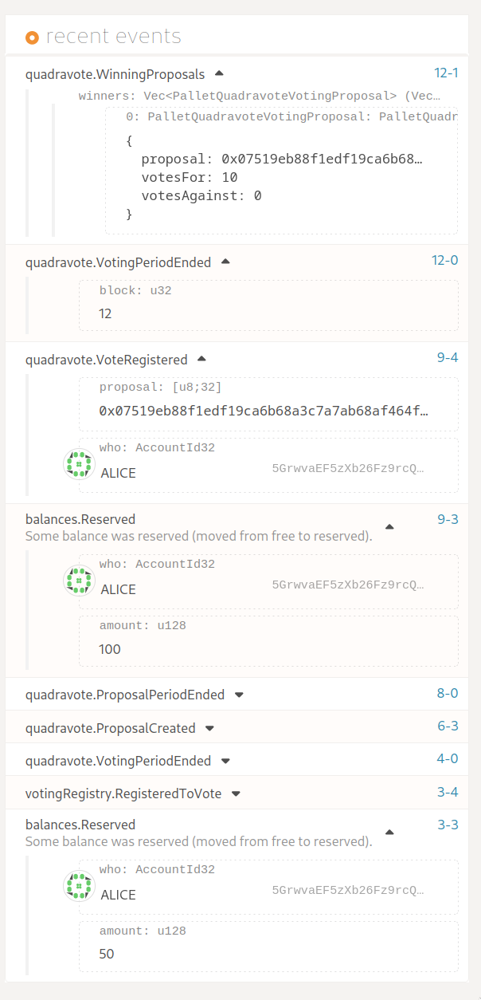

# Corpus

A quadratic voting parachain based on the
[Cumulus](https://github.com/paritytech/cumulus/)-based Substrate node.




## Relevant bits
In decreasing order of importance(ish)

- `./pallets/quadravote`
- `./pallets/votingregistry`
- `./runtime/`
- `./corpus-traits/`
- `./scripts/{start-collator-node, generate-genesis-wasm, generate-chain-spec}.sh`
- `./node/service/*
## Getting started

### Build
```shell
cargo build --release
```
### Run
The assumed `ParaId` is 2000 and has been tested runnig on a version of the
rococo local testnet named cambrelay which can be found 
[here](https://github.com/antonva/cambrelay/tree/release-v0.9.26). 
There's nothing special about this testnet so this should work on any relay network, there is however a stored chainspec for the cambrelay network in this node.

The branch that I've been working on is the release-v0.9.26 for cambrelay
but for corpus it's main.
```
./scripts/start-collator-node.sh
```
This will attempt to clean up the storage in `/tmp/corpus-parachain` and then start a collator node as Alice.

### Setup
Note that you generally do not need to run these as the
runtime and chainspec is included in the repository.

Also note that there is a problem with the generation of the chainspec
where it will add a bootnode even if you don't want one. Should you get an
error such as:

```shell
💔 The bootnode you want to connect provided a different peer ID than the one you expect:...
```

Then it should be fine to just carry on, but you can remove the entry from
the raw chainspec to get rid of it.

#### Generating chainspec
```shell
# From the root of the repository
./scripts/generate-chain-spec.sh
```

This will generate 3 separate json files that can be used to start the collator
and register a parachain. The files are located in `./node/service/chain-spec`
and `./node/service/raw-chain-spec`.

#### Generating wasm and genesis for parachains
```shell
# From the root of the repository
./scripts/generate-genesis-wasm.sh
```

This will create 2 files, the wasm runtime at genesis and the state at genesis.
Both files will be in `./node/service/genesis/`

## Using the pallets
Corpus implements two new pallets in addition to being run with Sudo at the moment.
These are `pallet-quadravote` and `pallet-votingregistry`.

### Pallet Voting Registry
Serves the function of providing an identity for an account
in order to vote. In this simple scheme there are no meatspace validations made
by a registrar so any account is a valid voter if they so choose. There is a runtime
adjustable amount of reserved currency reserved for being a registered voter.

Extrinsics:

- register: Registers the account which sent the transaction as a voter/proposer and reserves tokens.
- deregister: Removes the account from storage if exists and unreserves the tokens previously reserved.

Traits:

- IdentityInterface: A trait with a single function, is_identified, which takes an account and asks
`pallet_votingregistry` if it exists in storage.

### Pallet Quadravote

The quadratic voting system pallet

Extrinsics:

- create_proposal: submits a 32 byte hash representation of a proposal, can only happen in proposal period.
- withdraw_proposal: withdraws an existing proposal if originally created by the sender. Can only happen in proposal period.
- cast_vote: Casts votes on proposals via an index. can submit votes_for or votes_against.

Both `create_proposal` and `cast_vote` check for identity via the trait implemented by votingregistry.
`withdraw_proposal` does not as an account may have deregistered it's identity but still have funds
reserved in a proposal.

### One round example
We assume we start in the proposal period.

1. alice registers to vote by using `votingregistry` extrinsic `register`
2. alice creates a proposal by using `quadravote` extrinsic `create_proposal`
3. evelyn registers to vote by using `votingregistry` extrinsic `register`
4. both wait until voting period starts
5. alice votes for proposal `0` with all of their votes `10`, reserving 100
6. evelyn votes against proposal `0` with `5` votes, reserving 25
7. voting period ends
8. alice and evelyn are refunded their reserve, proposal `0`'s hash is recorded in enacted proposals

## Addendum - starting the parachain

- In cambrelay I've added a `./scripts/start-relay-chain.sh` which starts 2 validator nodes.
- Use polkadot.js to navigate to the relay chain, register a paraid
- Use polkadot.js on the relay chain, go to sudo, use the `paraSudoWrapper` and `sudoScheduleParaInitialize` extrinsic to upload the wasm and genesis
  located in `./node/service/genesis/` in the corpus repository
- The parachain should be registered and on cooldown
- If you haven't already, start the collator via `./scripts/start-collator-node.sh` in the corus repository
